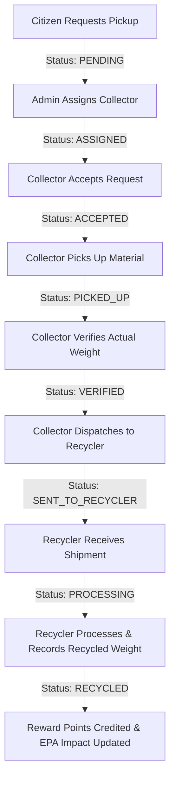

# PlasticLoop — Smart Plastic Waste Collection, Recycling and Reward Management Platform

**Production-Quality Final-Year B.Tech IT Project**

PlasticLoop is a full-stack MERN application that digitizes the complete circular lifecycle of plastic waste: from citizen pickup requests through collector verification, recycling plant processing, atomic reward point distribution, community leaderboards, and EPA-based environmental impact tracking.

---

## 🚀 Technology Stack

### Frontend
- **Framework**: React.js 18 + Vite 5
- **Styling**: Tailwind CSS + Custom Eco Dark Theme & Glassmorphism
- **Routing**: React Router DOM v6
- **Icons**: Lucide React
- **Data Visualization**: Recharts (Monthly collection trends, plastic distribution charts)
- **State & Auth**: Context API (`AuthContext`) + Axios with JWT interceptors

### Backend
- **Runtime**: Node.js + Express.js RESTful API
- **Database**: MongoDB Atlas via Mongoose ODM
- **Authentication**: JWT (JSON Web Tokens) + `bcryptjs` password hashing
- **Security**: Helmet, CORS, Input & Schema Validation
- **File Uploads**: Multer image upload handler with static serving fallback
- **Architecture**: Controller-Service-Model architecture with centralized error handling

---

## 👥 Stakeholder User Roles

### 1. 👤 USER (Citizen)
- Register & Login with JWT authentication.
- Request plastic waste pickup with plastic category selection, estimated weight, address, preferred date/time slot, and photo upload.
- Interactive **AI Plastic Scanner Helper** (FastAPI AI architecture preview) to detect plastic resin codes.
- Live active pickup request tracker with step-by-step progress bar.
- View verified recycling history & points earned.
- Redeem reward vouchers (Amazon Gift Cards, Stainless Steel Flasks, Tree Planting Certificates) with atomic points deduction.
- View Community Leaderboard rankings & badges.
- Inspect detailed environmental impact metrics (CO2 avoided, energy saved, landfill space saved, trees equivalent).

### 2. 🚚 COLLECTOR (Logistics Agent)
- View assigned pickup requests queue.
- Accept assigned pickup requests.
- Mark material as picked up.
- Verify actual scale weight & upload collection proof image.
- Dispatch verified waste shipment to recycling plants.
- View collection history & total KG collected statistics.

### 3. 🏭 RECYCLER (Recycling Facility)
- View incoming waste shipments.
- Receive shipments into the processing queue.
- Record recycled yield (KG) vs rejected contaminated waste (KG) with validation (`recycledWeight + rejectedWeight <= receivedWeight`).
- Complete recycling batch and automatically credit verified reward points to the citizen's wallet.
- View facility yield history & analytics.

### 4. 🛡️ ADMIN (Platform Administrator)
- Overview dashboard with ecosystem totals, active requests, total plastic recycled, and recycling rate %.
- Assign available collectors to pending citizen pickup requests.
- User management (search, role update, active/deactive toggles).
- Manage plastic categories and points-per-kg multipliers.
- Inspect all ecosystem pickup requests and audit redemption logs.
- Real-time MongoDB aggregation analytics with Recharts visualization.

---

## 🔄 Core Business Workflow



---

## 🔐 Demo Credentials

The application includes an automated seed script with rich pre-loaded demo accounts:

| Role | Email | Password |
|---|---|---|
| **ADMIN** | `admin@plasticloop.com` | `password123` |
| **COLLECTOR** | `collector@plasticloop.com` | `password123` |
| **RECYCLER** | `recycler@plasticloop.com` | `password123` |
| **USER / CITIZEN** | `user@plasticloop.com` | `password123` |

---

## 🛠️ Project Structure

```
plasticloop/
├── backend/
│   ├── config/          # Database connection
│   ├── controllers/     # Auth, Pickup, Collector, Recycler, Admin, Reward controllers
│   ├── middleware/      # Auth JWT, RBAC, Multer upload & Centralized Error Handler
│   ├── models/          # Mongoose models (User, PlasticType, PickupRequest, Collection, RecyclingRecord, Reward, Redemption, Notification, ImpactRecord)
│   ├── routes/          # Express API route modules
│   ├── seed/            # MongoDB seed script
│   ├── app.js           # Express app setup
│   ├── server.js        # Node server entrypoint
│   └── .env
│
├── frontend/
│   ├── src/
│   │   ├── components/  # Navbar, Sidebar, StatCard, StatusBadge, AIPlasticScannerModal, ImageUploader, Modal, NotificationDropdown
│   │   ├── context/     # AuthContext with global state & toast notifications
│   │   ├── pages/       # Public, Auth, User, Collector, Recycler & Admin pages
│   │   ├── routes/      # ProtectedRoute & RoleRoute guards
│   │   ├── services/    # Axios API instance with JWT interceptor
│   │   ├── App.jsx      # Main router configuration
│   │   ├── main.jsx     # Vite entry point
│   │   └── index.css    # Tailwind CSS & custom eco dark styling
│   ├── package.json
│   └── vite.config.js
│
└── README.md
```

---

## ⚡ Quick Start Guide

### 1. Backend Setup
```bash
cd backend
npm install
node seed/seed.js   # Seed MongoDB database with initial categories & demo data
node server.js       # Starts Express backend on http://localhost:5000
```

### 2. Frontend Setup
```bash
cd frontend
npm install
npm run dev          # Starts Vite dev server on http://localhost:5173
```

Open [http://localhost:5173](http://localhost:5173) in your browser to explore PlasticLoop!
